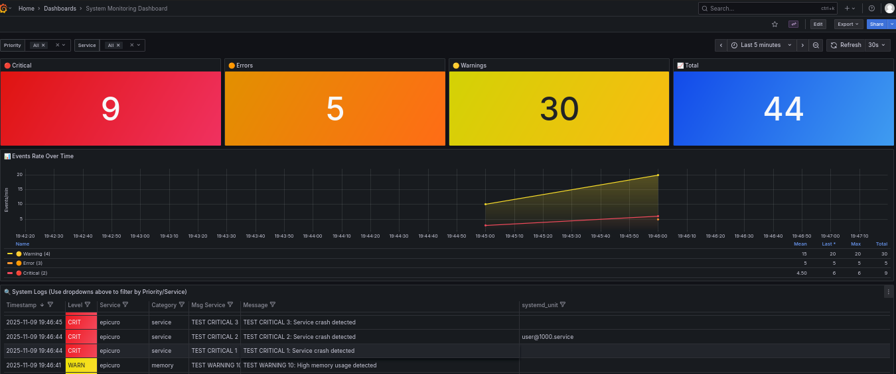

# Debian Monitoring System with InfluxDB 2.7

Lightweight monitoring system for Debian using Docker Compose, Fluent Bit, InfluxDB 2.7, and Grafana dashboards.

## Grafana dashboard Preview



## Features

- ✅ No software installation on host (Docker only)
- ✅ System log collection via journald
- ✅ Time-series storage with InfluxDB 2.7 (Flux query language)
- ✅ Professional Grafana dashboard with real-time monitoring
- ✅ Pre-configured dashboard with 7 visualization panels
- ✅ Minimal resource consumption (~450KB RAM for Fluent Bit)
- ✅ Free and open-source

## Requirements

- Docker and Docker Compose installed
- Debian with systemd (journald)
- iptables configured (native in Debian)

## Installation

### 1. Clone or create directory structure

```bash
mkdir -p fluent-bit influxdb-data grafana-data
```

Grafana will run with your current user permissions (no sudo needed).

### 2. Configure environment variables

Copy the example file and customize it:

```bash
cp .env.example .env
```

Edit the `.env` file and customize the values, especially:
- `INFLUXDB_ADMIN_PASSWORD` - Change to a strong password
- `INFLUXDB_TOKEN` - Generate a secure token (see commands below)

Generate a secure token:
```bash
# Option 1: Using openssl
openssl rand -base64 32

# Option 2: Using /dev/urandom
cat /dev/urandom | tr -dc 'a-zA-Z0-9' | fold -w 64 | head -n 1
```

### 3. Configure iptables for logging (optional - not implemented)

This monitoring system focuses on system logs only. Network security monitoring has been removed to keep the scope minimal and focused.

### 4. Start the stack

```bash
docker compose up -d
```

The `setup.sh` script will automatically:
- Create directory structure with proper permissions
- Start all services
- Verify container status

Alternatively, start manually:
```bash
# Export your user ID (required for Grafana)
export UID=$(id -u)
export GID=$(id -g)

# Start services
docker compose up -d
```

### 5. Verify operation

```bash
# Check container status
docker compose ps

# View Fluent Bit logs
docker compose logs -f fluent-bit

# Check Fluent Bit metrics
curl http://localhost:2020/api/v1/metrics

# Check InfluxDB buckets
docker exec influxdb influx bucket list --org debian_monitoring
```

### 6. Access the dashboards

- **Grafana UI**: http://localhost:3000
  - Username: `admin` (from .env)
  - Password: `GrafanaAdmin123` (from .env)
  - Pre-configured dashboard:
    - **System Monitoring Dashboard**: Complete system monitoring with:
      - Critical events, warnings, and total events counters
      - Events distribution by priority (pie chart)
      - System events rate over time
      - Errors and warnings timeline
      - Recent system logs table with color-coded priorities
      - Auto-refresh every 30 seconds

- **InfluxDB UI**: http://localhost:8086
  - Username: `admin` (from .env)
  - Password: `SecurePassword123` (from .env)
  - Org: `debian_monitoring`

## Retention Configuration

The system uses InfluxDB's built-in retention policies for automatic data management:

- **System logs**: 60 days (2 months) - bucket: `system_logs`

### Automatic Data Retention

InfluxDB automatically deletes data older than the retention period. No manual cleanup needed!

Data is organized by month using the `month_bucket` tag (e.g., `2025_11`), which allows you to:
- Query specific months
- See data distribution over time
- Understand storage usage patterns

### Bucket Creation

Buckets are created automatically when InfluxDB starts or when Fluent Bit sends data. No manual setup needed!

The system uses a single bucket:
- `system_logs` (60-day retention)

### Manual Bucket Management

```bash
# List all buckets with retention info
docker exec -it influxdb influx bucket list

# Update retention policy (if needed)
docker exec -it influxdb influx bucket update \
  --name system_logs \
  --retention 90d \
  --org debian_monitoring
```

## Example Flux Queries

InfluxDB 2.7 uses Flux query language. Access via Grafana or InfluxDB UI:

```flux
// Critical system errors (last hour)
from(bucket: "system_logs")
  |> range(start: -1h)
  |> filter(fn: (r) => r._measurement == "system.journal")
  |> filter(fn: (r) => r.priority == "0" or r.priority == "1" or r.priority == "2" or r.priority == "3")
  |> sort(columns: ["_time"], desc: true)

// System events rate by hour (last 24 hours)
from(bucket: "system_logs")
  |> range(start: -24h)
  |> filter(fn: (r) => r._measurement == "system.journal")
  |> filter(fn: (r) => r._field == "priority")
  |> aggregateWindow(every: 1h, fn: count)
  |> sort(columns: ["_time"], desc: true)

// Query specific month using month_bucket tag
from(bucket: "system_logs")
  |> range(start: -60d)
  |> filter(fn: (r) => r.month_bucket == "2025_11")
  |> filter(fn: (r) => r._measurement == "system.journal")
  |> filter(fn: (r) => r.priority == "0" or r.priority == "1" or r.priority == "2" or r.priority == "3")
  |> count()

// Events grouped by priority
from(bucket: "system_logs")
  |> range(start: -1h)
  |> filter(fn: (r) => r._measurement == "system.journal")
  |> filter(fn: (r) => r._field == "priority")
  |> group(columns: ["priority"])
  |> count()
```

See documentation in `docs/` for more examples and detailed guides.

## Management

```bash
# Stop the stack
docker compose down

# Stop and remove volumes
docker compose down -v

# View logs in real-time
docker compose logs -f

# Restart a specific service
docker compose restart fluent-bit
```

## File Structure

```
.
├── docker-compose.yml       # Service definitions (InfluxDB, Fluent Bit, Grafana)
├── .env.example             # Environment variables template
├── .env                     # Environment variables (do not version)
├── setup.sh                 # Quick setup script
├── fluent-bit/
│   ├── fluent-bit.conf     # Fluent Bit configuration
│   └── bucket_router.lua   # Lua script for monthly bucket tagging
├── grafana/
│   ├── provisioning/
│   │   ├── datasources/    # Auto-configured InfluxDB datasource
│   │   └── dashboards/     # Dashboard provisioning config
│   └── dashboards/
│       └── system-monitoring.json  # System monitoring dashboard
├── influxdb-data/          # InfluxDB persistent data (created on startup)
├── grafana-data/           # Grafana persistent data (created on startup)
├── docs/
│   ├── fluent-bit-guide.md        # Complete Fluent Bit guide
│   ├── lua-basics.md              # Lua syntax for Fluent Bit
│   └── influxdb-introduction.md   # InfluxDB concepts and queries
└── README.md               # This documentation
```

## System Monitoring

**Grafana Dashboard** (http://localhost:3000):
- System Monitoring Dashboard - `/d/system-monitoring`
  - Real-time monitoring with 7 panels:
    1. Critical Events (1h) - Red alert counter
    2. Warnings (1h) - Yellow warning counter
    3. Total Events (1h) - Blue info counter
    4. Events by Priority - Pie chart distribution
    5. System Events Rate - Time series graph
    6. Errors and Warnings Over Time - Stacked bar chart
    7. Recent System Logs - Detailed table with color-coded priorities
  - Auto-refresh: 30 seconds
  - Time range: Last 6 hours (customizable)

**Fluent Bit** exposes metrics on port 2020:
- Metrics: http://localhost:2020/api/v1/metrics
- Health check: http://localhost:2020/api/v1/health

**InfluxDB** is available at:
- HTTP API: http://localhost:8086
- Web UI: http://localhost:8086

## Documentation

Comprehensive guides available in the `docs/` directory:

- **[fluent-bit-guide.md](docs/fluent-bit-guide.md)** - Complete Fluent Bit guide
  - Pipeline architecture (INPUT → FILTER → OUTPUT)
  - Common plugins (systemd, tail, CPU/memory)
  - Filters (grep, record_modifier, parser, lua)
  - Output configuration
  - Best practices and debugging

- **[lua-basics.md](docs/lua-basics.md)** - Lua syntax for Fluent Bit
  - Variables and data types
  - Tables (arrays and dictionaries)
  - Control structures and loops
  - String operations
  - Common patterns for log processing

- **[influxdb-introduction.md](docs/influxdb-introduction.md)** - InfluxDB concepts
  - Time series database fundamentals
  - Data model (measurements, tags, fields, timestamps)
  - Organizations and buckets
  - Flux query language
  - Authentication and retention policies
  - Best practices

## License

This project uses open source components:
- InfluxDB 2.7 (MIT License)
- Fluent Bit (Apache 2.0)
- Grafana (AGPL-3.0 License)
